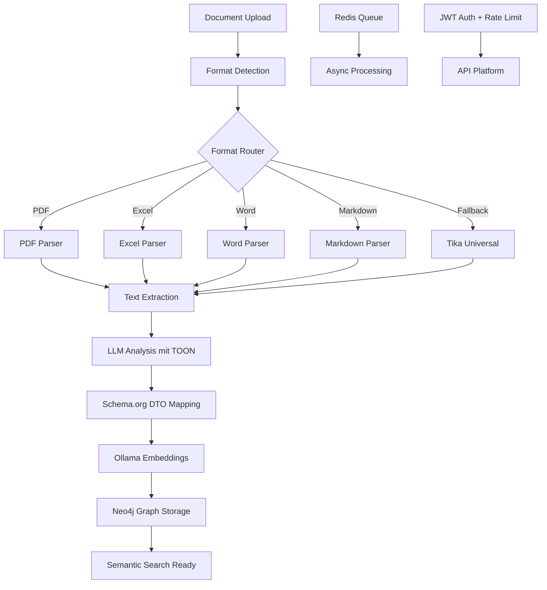

# 🧠 RAGinald - Software Requirements Extraction

Eine **production-ready RAG-Pipeline** für **Software Requirements Extraction** basierend auf **Symfony**, **API Platform**, **TOON Format**, **Ollama LLM**, und **Neo4j** für intelligente Dokumentenverarbeitung und semantische Suche.

## 🎯 **Überblick**

Diese Anwendung extrahiert automatisch Software-Requirements aus Dokumenten und strukturiert sie nach **Schema.org Standards** (`SoftwareApplication` + `SoftwareRequirements`):

- 📄 **Intelligente Dokumenten-Extraktion** (Format Router + Native Parser für PDF/Excel/Word/Markdown)
- 🤖 **LLM-basierte Requirements-Analyse** (Ollama mit TOON Format)
- 📊 **Schema.org DTO Mapping** (SoftwareApplication/Requirements)
- 🔢 **Vektorisierung** (Ollama Embeddings)
- 🗄️ **Graph-Datenbank Speicherung** (Neo4j)
- 🔍 **Semantische Suche** in Requirements
- ⚡ **Asynchrone Verarbeitung** (Symfony Messenger + Redis Queue)
- 🔐 **JWT Authentication** (API Platform Security)
- 🚦 **Rate Limiting** (konfigurierbar per ENV)

---

## 🚀 **Quick Start**

### 🐳 **Option 1: Docker (Empfohlen)**

```bash
# 1. Services starten (Tika, Neo4j, Ollama)
docker-compose up -d

# 2. LLM-Modelle installieren (einmalig)
docker exec raginald_ollama ollama pull llama3.2
docker exec raginald_ollama ollama pull nomic-embed-text

# 3. JWT Keys generieren (einmalig)
mkdir -p config/jwt
php bin/console lexik:jwt:generate-keypair

# 4. Database Setup
php bin/console doctrine:database:create
php bin/console doctrine:migrations:migrate --no-interaction

# 5. Neo4j Indexes erstellen
php bin/console app:neo4j:init

# 6. API testen
curl http://localhost:8000/api/health
```

**Zugangsdaten:**
- **Neo4j Browser**: http://localhost:7474 (neo4j / password)
- **API**: http://localhost:8000/api
- **API Docs**: http://localhost:8000/api/docs

### ⚙️ **Option 2: Lokale Installation (WSL2/Linux)**

```bash
# 1. Dependencies installieren (bereits erledigt)
composer install

# 2. Services manuell starten
docker run -d -p 9998:9998 apache/tika              # Tika
docker run -d -p 7474:7474 -p 7687:7687 \           # Neo4j
  -e NEO4J_AUTH=neo4j/password neo4j:5.15
ollama serve                                         # Ollama (lokal)

# 3. Modelle installieren
ollama pull llama3.2
ollama pull nomic-embed-text

# 4. JWT Keys generieren
mkdir -p config/jwt
php bin/console lexik:jwt:generate-keypair

# 5. Database Setup
php bin/console doctrine:database:create
php bin/console doctrine:migrations:migrate --no-interaction

# 6. Redis starten (für Message Queue)
docker run -d -p 6379:6379 redis:alpine

# 7. Message Worker starten (in separater Shell)
php bin/console messenger:consume async -vv

# 7. Development Server starten
symfony serve -d
# oder
php -S 0.0.0.0:8000 -t public
```

---

## ⚙️ **Konfiguration**

### **Environment Variablen**

Die wichtigsten Konfigurationsoptionen können über die `.env` Datei gesteuert werden:

#### **Rate Limiting**

```bash
# Rate Limiting aktivieren/deaktivieren
RATE_LIMIT_ENABLED=true          # true = aktiv, false = deaktiviert

# Anzahl erlaubter Requests
RATE_LIMIT_REQUESTS=3            # z.B. 3 Requests

# Zeitfenster für Rate Limit
RATE_LIMIT_INTERVAL="1 minute"   # z.B. "1 minute", "60 seconds", "5 minutes"
```

**Beispiele:**
- **Development**: `RATE_LIMIT_ENABLED=false` (deaktiviert)
- **Production**: `RATE_LIMIT_ENABLED=true`, `RATE_LIMIT_REQUESTS=100`, `RATE_LIMIT_INTERVAL="1 hour"`
- **Strict**: `RATE_LIMIT_ENABLED=true`, `RATE_LIMIT_REQUESTS=3`, `RATE_LIMIT_INTERVAL="1 minute"`

#### **Service URLs**

```bash
# LLM Service (Ollama)
OLLAMA_URL=http://localhost:11434
OLLAMA_MODEL=llama3.2
OLLAMA_EMBEDDING_MODEL=nomic-embed-text

# Document Extractor (Tika)
DOCUMENT_EXTRACTOR_URL=http://localhost:9998

# Graph Database (Neo4j)
NEO4J_URL=bolt://localhost:7687
NEO4J_USER=neo4j
NEO4J_PASSWORD=password

# Message Queue (Redis)
REDIS_URL=redis://localhost:6379

# JWT Authentication
JWT_SECRET_KEY=%kernel.project_dir%/config/jwt/private.pem
JWT_PUBLIC_KEY=%kernel.project_dir%/config/jwt/public.pem
JWT_PASSPHRASE=your_passphrase_here
```

**💡 Tipp**: Für Development kann Rate Limiting deaktiviert werden:
```bash
RATE_LIMIT_ENABLED=false
```

---

## 🔗 **API Endpunkte**

### **Authentication**

```bash
# Login (JWT Token erhalten)
curl -X POST http://localhost:8000/api/login \
  -H "Content-Type: application/json" \
  -d '{
    "username": "admin",
    "password": "admin123"
  }'

# Response:
# {"token": "eyJ0eXAiOiJKV1QiLCJhbGc..."}
```

### **Requirements Extraction**

```bash
# 1. Requirements aus Dokument extrahieren
curl -X POST http://localhost:8000/api/requirements/extract \
  -H "Authorization: Bearer YOUR_JWT_TOKEN" \
  -H "Content-Type: application/json" \
  -d '{
    "documentPath": "/path/to/requirements.pdf",
    "projectName": "My Software Project",
    "extractionOptions": {
      "llmModel": "llama3.2",
      "temperature": 0.7,
      "async": true
    }
  }'

# Response:
# {
#   "id": "01932c8e-7b4a-7890-a123-456789abcdef",
#   "status": "processing",
#   "documentPath": "/path/to/requirements.pdf",
#   "projectName": "My Software Project",
#   "createdAt": "2025-01-15T10:30:00+00:00"
# }

# 2. Job-Status abfragen
curl -X GET http://localhost:8000/api/requirements/jobs/01932c8e-7b4a-7890-a123-456789abcdef \
  -H "Authorization: Bearer YOUR_JWT_TOKEN"

# 3. Alle Jobs auflisten
curl -X GET http://localhost:8000/api/requirements/jobs \
  -H "Authorization: Bearer YOUR_JWT_TOKEN"
```

### **Health Checks**

```bash
# Service Status prüfen (ohne Auth)
curl http://localhost:8000/api/health

# Verfügbare LLM-Modelle (ohne Auth)
curl http://localhost:8000/api/models
```

---

## 🏗️ **Architektur**

### **Requirements Extraction Pipeline**



### **Document Extraction Router**

Intelligente Format-Erkennung und Parser-Selection:

1. **Format Detection** → MIME-Type via `symfony/mime`
2. **Parser Selection** → Best parser by priority
3. **Native Parsers** → PDF, Excel, Word, Markdown
4. **Fallback** → Apache Tika für alle anderen Formate

**Unterstützte Formate:**
- ✅ **PDF** (`smalot/pdfparser`)
- ✅ **Excel** (XLSX, XLS, CSV, ODS via `phpoffice/phpspreadsheet`)
- ✅ **Word** (DOCX, DOC, RTF, ODT via `phpoffice/phpword`)
- ✅ **Markdown** (Native PHP)
- ✅ **Plain Text** (TXT, HTML, XML, JSON)
- ✅ **Images** (OCR via Tesseract - optional)
- ✅ **Alle anderen** (Apache Tika Fallback)

### **TOON Format - Token-Optimierung**

Diese Anwendung nutzt **[TOON (Token-Oriented Object Notation)](https://github.com/HelgeSverre/toon-php)** für LLM-Kommunikation:

- ✅ **~50% Token-Ersparnis** gegenüber JSON
- ✅ **~68% Token-Ersparnis** gegenüber XML
- ✅ Bessere LLM-Verständlichkeit durch strukturierte Notation
- ✅ Kompakte Arrays und Objekte

**Beispiel:**

```toon
requirements[3]:
  - identifier: REQ-001
    name: User Authentication
    description: System shall support email/password login
    requirementType: functional
    priority: must
    tags[2]: auth, security
  - identifier: REQ-002
    name: Response Time
    description: API responses within 200ms
    requirementType: performance
    priority: should
    tags[1]: performance
```

vs. JSON (deutlich länger):

```json
{
  "requirements": [
    {
      "identifier": "REQ-001",
      "name": "User Authentication",
      "description": "System shall support email/password login",
      "requirementType": "functional",
      "priority": "must",
      "tags": ["auth", "security"]
    },
    ...
  ]
}
```

---

## 📊 **Schema.org DTOs**

### **SoftwareApplication**

```php
$application = new SoftwareApplicationDTO(
    name: 'My Software',
    description: 'Project description',
    requirements: [/* array of SoftwareRequirementsDTO */]
);
```

### **SoftwareRequirements**

```php
$requirement = new SoftwareRequirementsDTO(
    identifier: 'REQ-001',
    name: 'User Login',
    description: 'System shall allow users to log in',
    requirementType: 'functional', // functional, non-functional, technical, business, security, performance, usability
    priority: 'must' // must, should, could, wont (MoSCoW)
);
```

---

## ⚡ **Performance Features**

### **Token-Optimierung mit TOON**

- **Durchschnittliche Ersparnis**: 50% vs JSON, 68% vs XML
- **Beispiel**: 10.000 Token (JSON) → 5.000 Token (TOON)
- **Kosten-Reduktion**: ~50% bei Token-basierten APIs

### **Asynchrone Verarbeitung**

- **Message Queue** für schwere Operationen
- **Background Workers** via Symfony Messenger
- **Graceful Error Recovery**

### **Embeddings & Semantic Search**

- **Ollama Embeddings**: nomic-embed-text (768 dim), mxbai-embed-large (1024 dim)
- **Cosine Similarity** für semantische Suche
- **Neo4j Vector Storage** mit GDS Plugin

---

## 🛡️ **Security Features**

### **JWT Authentication**

- API Platform Security Integration
- Token-basierte Authentifizierung
- Role-based Access Control (RBAC)

### **Input Validation**

- Symfony Validator Constraints
- Path Traversal Protection
- Schema.org DTO Validation

---

## 🐛 **Troubleshooting**

### **LLM gibt keine Requirements zurück**

```bash
# 1. Modell prüfen
docker exec raginald_ollama ollama list

# 2. Modell installieren
docker exec raginald_ollama ollama pull llama3.2

# 3. Service-Status prüfen
curl http://localhost:8000/api/health
```

### **Message Queue läuft nicht**

```bash
# Redis Status prüfen
redis-cli ping  # Should return: PONG

# Worker-Status prüfen
php bin/console messenger:stats

# Failed messages anzeigen
php bin/console messenger:failed:show

# Worker manuell starten
php bin/console messenger:consume async -vv

# Redis Queue löschen (bei Problemen)
redis-cli DEL raginald_async
redis-cli DEL raginald_failed
```

### **Neo4j Connection Failed**

```bash
# Container prüfen
docker ps | grep neo4j

# Logs anzeigen
docker logs raginald_neo4j

# Browser öffnen
open http://localhost:7474
```

---

## 📚 **Technologie-Stack**

### **Core**
- **Framework**: Symfony 7.2 LTS
- **API**: API Platform 4.0
- **LLM**: Ollama (llama3.2, nomic-embed-text)
- **Format**: TOON-PHP v2.0 (Token-Optimierung)
- **Graph DB**: Neo4j 5.15
- **Cache/Queue**: Redis (Refresh Tokens + Message Queue)

### **Document Processing**
- **Format Detection**: Symfony MIME Component
- **PDF Parser**: smalot/pdfparser
- **Excel Parser**: phpoffice/phpspreadsheet
- **Word Parser**: phpoffice/phpword
- **Fallback**: Apache Tika

### **Security & Performance**
- **Auth**: Lexik JWT Authentication
- **Rate Limiting**: Symfony Rate Limiter (konfigurierbar)
- **Queue**: Symfony Messenger + Redis Streams

---

## 🤝 **Contributing**

Das System folgt **Symfony Best Practices**, **API Platform Patterns**, und **Schema.org Standards**:

1. **Interface-basierte Services**
2. **State Processors/Providers** (API Platform)
3. **Message Handlers** für Async Logic
4. **DTO-basierte Validierung**
5. **TOON Format** für LLM-Kommunikation

---

## 📈 **Roadmap**

- [ ] Doctrine Entity Persistence für Jobs
- [ ] Redis Cache Layer für Production
- [ ] GraphQL API Support
- [ ] Real-time WebSocket Updates
- [ ] Multiple Document Formats (CSV, Excel, etc.)
- [ ] Advanced Neo4j Queries (Cypher DSL)
- [ ] CI/CD Pipeline (GitHub Actions)

---

**Eine vollständig optimierte, production-ready RAG-Pipeline für Software Requirements Extraction! 🚀**

*Entwickelt mit Symfony 7.2 LTS, API Platform 4.0, TOON Format, und Schema.org Standards.*

